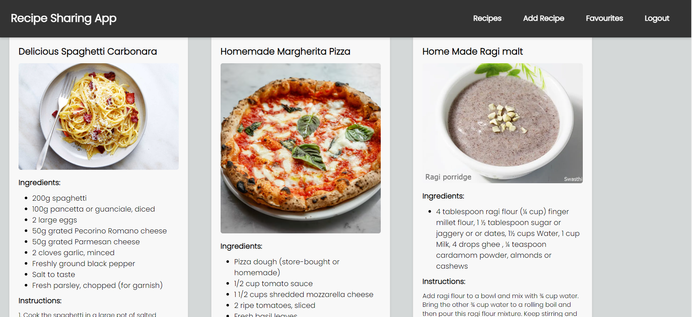
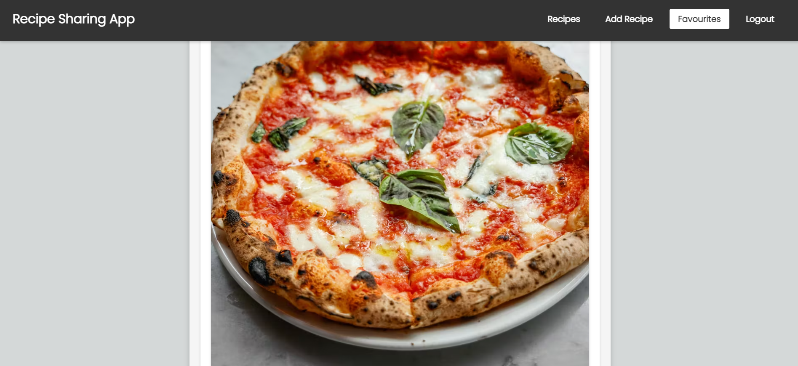

# VEERAVELLY KUSUMITHA
**NAME**: VEERAVELLY KUSUMITHA  
**COMPANY**: CODTECH IT SOLUTIONS PVT. LTD  
**ID**: CT06DS1774  
**DOMAIN**: FULL STACK DEVELOPMENT  
**DURATION**: August 25th to October 10th, 2024


## OVERVIEW OF THE PROJECT


## PROJECT: Recipe Sharing Full Stack App (MERN Stack)


## OBJECTIVES
This project is a recipe-sharing platform where users can share, view, and save recipes.  
Users can register and log in, as well as create, delete, read, and update recipes.


## KEY Features

1. **User Authentication**: Secure user authentication and registration system.
2. **Recipe Management**: Create, edit, and delete your recipes.
3. **Recipe Discovery**: Browse and search for recipes shared by other users.
4. **Comments and Ratings**: Leave comments and rate recipes.
5. **Favorite Recipes**: Save your favorite recipes for easy access.
6. **Responsive Design**: Works seamlessly on both desktop and mobile devices.


## Getting Started

1. Clone the repository:

   ```bash
   git clone https://github.com/Rohith-Manjunath/MERN-Recipe-App.git

2. Navigate to the project directory:

       cd Mern-Recipe-App   

3. Navigate to the client directory:
     
       cd client 
       cd my-app 

4. Install client dependencies:

       npm install 

5. Return to the project root:

       cd ..
       cd ..

6. Navigate to server folder:

       cd server

7. Create a `.env` file in the project root and configure your environment variables:
   
       PORT=2000
       MONGODB_URI=mongodb://localhost/recipe-app
       SECRET=your-secret-key

Replace `your-secret-key` with a secure secret for JWT token generation.

8. Start the development server

       node index.js


## Folder Structure
The project follows a standard MERN stack folder structure:

- client: Contains the React frontend application.
- server: Contains the Express.js backend application.
- Schema: Define the MongoDB schemas and models.
- routes: Define the API routes.
- controllers: Handle route logic and interact with the database.
- middlewares: Custom middleware functions.
- db: Configuration files (e.g., database connection).

## Technologies Used
#### Frontend:

- React

#### Backend:

- Node.js
- Express.js
- MongoDB (Mongoose)
- JSON Web Tokens (JWT) for authentication
- bcrypt for secured password hashing

- ## Screenshots
 
 ;
 ;
 ;
 ;

## Live Demo

Check out the live demo of the Recipe Sharing Full Stack App [here](https://benevolent-donut-65e579.netlify.app).

